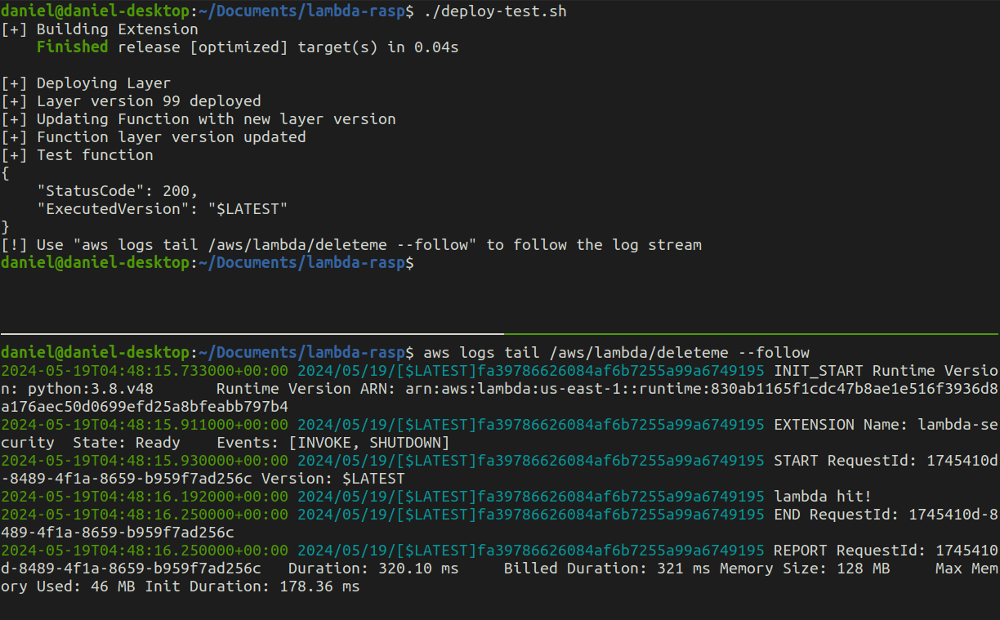
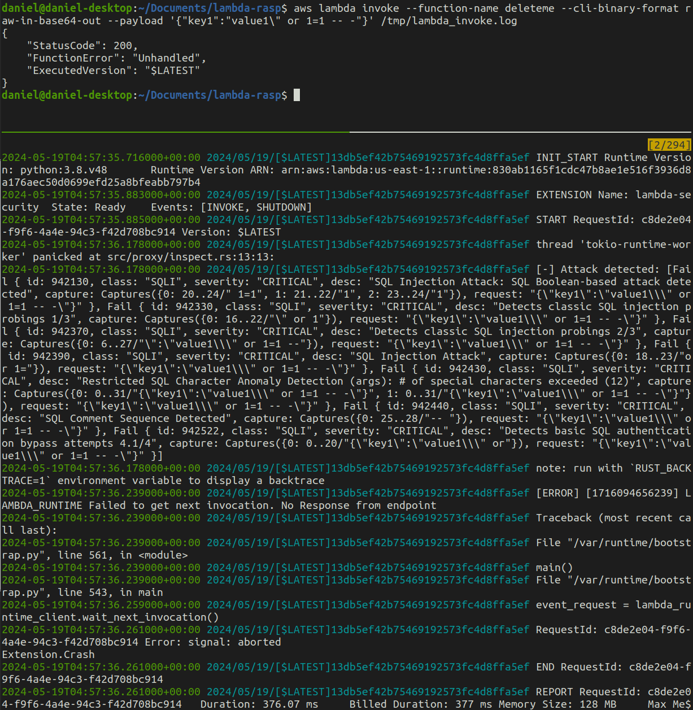

# Lambda RASP
This runtime application self-protection (RASP) solution is designed for AWS Lambda functions.  Lambda-rasp is added to existing functions as a layer/extension and runs within the targeted function.  When the function is started, the lambda-rasp layer modifies the container's memory replacing AWS's native runtime API with a new socket value pointing to a local web server setup by lambda-rasp on initialization.  Events passed to the function then go directly to lambda-rasp *before* reaching the function's application handler.  This positions lambda-rasp as an inspection point where many OWASP ModSecurity regex rules have been hardcoded to check incomping events for malicious strings.  If a malicious string is detected lambda-rasp will describe the rules violated and kill further processing *before* the event would be passed to the function's application.


# Configuration
> Consider the Performance section for config setting guidance
The following constants are set in `src/main.rs` and are used to tune and troubleshoot lambda-rasp deployments based on your needs:
- VERBOSE: display debug messages
- FAIL_OPEN: run lambda if layer fails
- BLOCKING_MODE: Kill lambda if Rule violated
- RULE_MODE: Performance vs security tuning:
  0=performance, rule run durations 0-10ms
  1=balanced, rule run duration 11-99ms
  2=paranoid, rule run durations 100+ms
- RULE_CLASS: Set the classes of rules to apply.  Limited by RULE_MODE.  For example, if RFI RULE_CLASS is selected with RULE_MODE 0, only the RFI rules in mode 0 will be used.

**Class counts by mode**
| Class | Mode 0 | Mode 1 | Mode 2 |
| --- | --- | --- | --- |
| LFI      | 0 | 1 | 0 |
| RFI      | 1 | 3 | 0 |
| RCE      | 14 | 13 | 5 |
| DESERIAL | 5 | 0 | 0 |
| PP       | 1 | 0 | 0 |
| DOS      | 0 | 1 | 0 |
| SSRF     | 0 | 1 | 0 |
| XSS      | 10 | 4 | 1 |
| TEMPLATE | 1 | 0 | 0 |
| SQLI     | 22 | 23 | 1 |
| NOSQLI   | 1 | 0 | 0 |
| FIXATION | 0 | 2 | 0 |
| UPLOAD   | 1 | 0 | 0 |


# Performance
The following table offers example time costs of running lambda-rasp using various settings.
| Mode | Classes | Duration |
| --- | --- | --- |
| 0 | null | ~8ms |
| 0 | RCE | ~148ms |
| 0 | RCE, SQLI | 310ms |
| 1 | RCE, SQLI | ~1100ms |
| 1 | all | ~1579ms |
| 2 | all | ~2419ms |


# Deploy
1. Create function that you want to protect
2. Create a layer with x86_64 arch (no arm supported)
3. Update deploy-test.sh function variable with the name of the function from step 1.
4. Update deploy-test.sh layer variable with the arn of the layer created in step 2.
5. Update deploy-test.sh runtimes variable as needed
6. Configure AWS credentials (eg profile, environment variables, etc)
7. Run deploy-test.sh


# Example
Running benign payload scenario.  Deployed function (top pane), function events (bottom pane) displays "lambda hit!" which is from a Python print statement as a placeholder for the function's app.


Running malicious payload scenario.  Same deployment as above but this invoking the function with a SQL Injection payload.



# Local Test Environment
Using [Cargo Lambda](https://www.cargo-lambda.info/commands/watch.html#working-with-extensions) to build a lambda extension.

Install Cargo Lambda:
```
brew tap cargo-lambda/cargo-lambda
brew install cargo-lambda
```

Setup Test Function:
```
cargo lambda new --no-interactive test-function
cargo lambda watch -v
```

Attach Extension:
```
#from within extension directory
export AWS_LAMBDA_RUNTIME_API=http://[::]:9000/.rt
cargo run
#observe running test function log
```

Test Running Function+Extension:
```
cargo lambda invoke --data-ascii '{"command": "hi"}'
```

Deploy Extension
```
cargo lambda build --extension --release
cargo lambda deploy --extension --compatible-runtimes python3.8 --layer-arn arn:aws:lambda:us-east-1:134672723840:function:deleteme
```

## Local Test Notes
Run tests as root :(
Run tests with RULE_MODE=2 (paranoid)
`cargo check`
`cargo test -- --nocapture`
`cargo test rule_xss --`
1. Update memory.rs proc 1 heap (dec) memory address
    `printf "%d\n" 0x$(sudo cat /proc/1/maps | grep heap | awk -F"-" '{print $1}')`
2. start python web server on port 9001


## Remote Test Notes
Requires lambda function in account
Requires aws cli + default profile
1. Build extension: `cargo lambda build --extension --release`
2. Run `aws logs tail /aws/lambda/deleteme --follow`
3. Run ./deploy-test.sh
Manual remote test:
`aws lambda invoke --function-name deleteme --cli-binary-format raw-in-base64-out --payload '{"key1":"value1"}' /tmp/lambda_invoke.log`

# Credits
- AWS  great docs on how Lambda runtime operates.
- Clearvector's  repository.  Inspired the use of the memory/webserver design that underpins lambda-rasp.  Great research!
- OWASP's  repository.  Where the rules were pulled from.  Love ModSecurity WAF.
